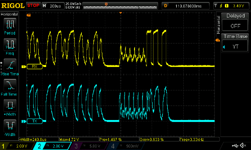

## SoftwareBitBang

| Medium | Pins used | Inclusion  |
|--------|-----------|--------------------|
| Wire   | 1 or 2    | `#include <PJONSoftwareBitBang.h>`|

`SoftwareBitBang` is a software implementation of [PJDL (Padded Jittering Data Link)](/src/strategies/SoftwareBitBang/specification/PJDL-specification-v5.0.md). It supports simplex and half-duplex asynchronous serial communication for up to 254 devices over a single wire. The maximum length of the bus can reach between 800 and 2000 meters depending on the mode used. It is a valid alternative to 1-Wire because of its flexibility and reliability. Fault tolerance schemes can be easily implemented because communication pins can be configured at runtime. Take a look at the [video introduction](https://www.youtube.com/watch?v=GWlhKD5lz5w) for a brief showcase of its features.
```cpp
PJDL SINGLE WIRE BUS                           ______
 ______    ______    ______    ______         |      |
|      |  |      |  |      |  |      |        |DEVICE|
|DEVICE|  |DEVICE|  |DEVICE|  |DEVICE|        |______|
|______|  |______|  |______|  |______|            |
___|__________|________|___________|______/\/\/\__| IO PIN
 ___|__    __|___    ___|__    ___|__  |  110-180 Ω
|      |  |      |  |      |  |      | |  
|DEVICE|  |DEVICE|  |DEVICE|  |DEVICE| |__/\/\/\__  GND
|______|  |______|  |______|  |______|    8 kΩ - 5 MΩ    
```
It is suggested to add 8kΩ-5MΩ pull-down resistor as shown in the graph above to reduce externally induced interference. The longer is the length of the cable and the higher is the amount of induced interference, the lower should be the resistance of the pull-down resistor. Pins can be optionally protected against overload adding a current limiting resistor to each connected pin. The resistor value can be obtained solving the following equation `R = (operating voltage / pin max current drain)`, for example to obtain the current limiting resistor value for an Arduino Uno simply substitute its characteristics: `R = (5v / 0.030A) = 166.66Ω`.

### Compatibility
| MCU              | Clock | Supported pins   |
| ---------------- |------ | ---------------- |
| ATtiny84/84A | 16MHz | 0, 1, 2, 3, 4 |
| ATtiny85 | 16MHz | 1, 2 |
| ATmega88/168/328 (Uno, Nano, Pro) | 16MHz | 2, 3, 4, 5, 6, 7, 8, 9, 10, 11, 12, 13, A0, A1 |
| ATmega328PB | 16MHz | 10 |
| ATmega16u4/32u4 (Leonardo, Micro) | 16MHz | 2, 4, 8, 12 |
| ATmega2560 (Mega, Mega nano) | 16MHz | 3, 4, 7, 8, 9, 10, 12 |
| ATmega1284P | 16MHz | 18, 19, 20, 21, 22, 23, A0, A1, A2, A3, A4, A5, A6, A7 |
| SAMD (Arduino Zero) | 48MHz | D0, D1, D3, A0, A1 |
| STM32F1 | 72MHz | PB15, PB14, PB13, PB12, PB11, PB10, PB9, PB8, PB7, PB6, PB4, PB3, PA15, PA10 |
| MK20DX256 (Teensy 3.1) | 96MHz | All pins |
| ESP8266 (NodeMCU, AI-THINKER) | 80/160MHz | D1 or GPIO 5 |
| ESP32 (Heltech WiFi LoRa) | 160MHz | 12, 25 |

### Performance
`SWBB_MODE` can be configured in 4 different modes, `1`, `2`, `3` and `4`:

| Mode | Speed | Range | Supported MCUs   |
| ---- | ----- |------ | ---------------- |
| `1`  | 1.97kB/s | 2000m | ATtiny84/84A/85, ATmega88/168/328/328PB/16u4/32u4/2560/1284P, SAMD, STM32F1, MK20DX256, ESP8266, ESP32 |  
| `2`  | 2.21kB/s | 1600m | ATtiny84/84A/85, ATmega88/168/328/328PB/16u4/32u4/2560, STM32F1 |
| `3`  | 3.10kB/s | 1200m | ATtiny84/84A/85, ATmega88/168/328, STM32F1 |
| `4`  | 3.34kB/s |  800m | ATtiny84/84A/85, ATmega88/168/328, STM32F1 |

When including and using the `SoftwareBitBang` strategy you have the complete access to the microcontroller. This happens because `SoftwareBitBang` runs a completely software-defined implementation, transforming a painful walk in a nice flight.

Communication over a single wire enables quick and creative experimentation. The first suggested test, at the tester's risk, is to let two Arduino boards communicate [through a living body](https://www.youtube.com/watch?v=caMit7nzJsM) touching with the left hand the digital pin of the first board and with the right the pin of the other one (should be harmless). It is stunning to see it working perfectly through the human body, although it also works through water and other conductors.



The picture above shows a [PJDL](/src/strategies/SoftwareBitBang/specification/PJDL-specification-v5.0.md) frame transmitted over a 800m twisted pair using mode `4`. Although bits are substantially deformed the exchange occurs nominally and performance is not affected. This experiment was done and published by [Jack Anderson](https://github.com/jdaandersj) in [LANC Video Camera Control](http://jda.tel/pdf/lanc_video_camera_control.pdf) - Department of Computer Science [Loughborough University](https://www.lboro.ac.uk/departments/compsci/) (UK).

### PJDL vs. 1-Wire

| Protocol | Communication speed | Range     | Communication mode     | Bus Control                |
| -------- | ------------------- | --------- | ---------------------- | -------------------------- |
| PJDL     | 1.97-3.34kB/s       | 800-2000m | Simplex or half-duplex | Multi-controller           |
| 1-Wire   | 2.03kB/s            | 300m      | Half-duplex            | Controller-peripheral only |

### Configuration
Before including the library it is possible to configure `SoftwareBitBang` using predefined constants:

| Constant                | Purpose                              | Supported value                            |
| ----------------------- |------------------------------------- | ------------------------------------------ |
| `SWBB_MODE`             | Data transmission mode               | 1, 2, 3, 4                                 |
| `SWBB_BACK_OFF_DEGREE`  | Maximum back-off exponential degree  | Numeric value (4 by default)               |
| `SWBB_MAX_ATTEMPTS`     | Maximum transmission attempts        | Numeric value (20 by default)              |
| `SWBB_PREAMBLE`         | Preamble Length                      | Numeric value (1 by default), max 100      |
| `SWBB_MAX_PREAMBLE`     | Maximum preamble length              | Numeric value (1 by default), max 100      |

`SoftwareBitBang` supports the use of input and output pins because separated signals may be required if additional circuitry is used for amplification or noise filtering. It also works if pins are directly connected as a simple point-to-point null-modem or cross-over serial link.

```cpp  
#include <PJONSoftwareBitBang.h>

PJONSoftwareBitBang bus;

void setup() {
  // Set the pin 12 as the communication pin
  bus.strategy.set_pin(12);
  // Set pin 11 as input pin and pin 12 as output pin
  bus.strategy.set_pins(11, 12);
}
```
After the PJON object is defined with its strategy it is possible to set the communication pin accessing to the strategy present in the PJON instance. All the other necessary information is present in the general [Documentation](/documentation).

### Why not interrupts?
In the Arduino environment the use of libraries is really extensive and often the end user is not able to go over collisions. Very often a library is using hardware resources of the microcontroller, colliding with other libraries. This happens because in general Arduino boards have limited hardware resources. Software-defined bit-banging, is a stable and reliable solution that leads to "more predictable" results than interrupt driven procedures coexisting on limited microcontrollers without the developer and the end user knowing about it.


PJON application example made by the user [Michael Teeuw](http://michaelteeuw.nl/post/130558526217/pjon-my-son)

### Known issues
- A 1-5 MΩ pull down resistor could be necessary to reduce interference, see [Mitigate interference](https://github.com/gioblu/PJON/wiki/Mitigate-interference).
- When using more than one instance of `SoftwareBitBang` in the same sketch use pins part of different port groups to avoid cross-talk.  
- During the execution of other tasks or delays a certain amount of packets could be potentially lost because tr0\rßm˚¸aÃo°Í_keyhttps://docs.github.com/_next/static/chunks/689-750ed063ef1f3568.js 
https://docs.github.com/ÿA
óEo˙Ùõ”ŒWdQ/∏âò#cØfi¿aœ<{!Ω䇣ò$S®®`
4L`QbÊ0J∂selfQ˙º∂ˇwebpackChunk_N_EQbñÆıpush9
`L`ë`Mab`@§b¨C`<C`¸C`^1C`ú!C`@(C`$Sµ
Pd	push.2646aLBQbX)2646EDâ
PPLZèÊhChttps://docs.github.com/_next/static/chunks/689-750ed063ef1f3568.jsaD`D`D`¸A`z,$Sπ
Pcpush.798aO¯
HÏo8ıÅ@ÿÑ@Ï≤@Í
ÿ@**∏*Äàëd	èô@Qbx798E<c@çD$SêPcpush.638a"$ëfûæ!@â"Ω"
@(† ëf«˜@ó£@Qb¯	638Eíc@ÇD$SìPd	push.6319a0‹Qbºb6319Eíc@$SêPd	push.4302aÍÙ Hëm0˘'≠)@ª)î3
@°3±>
@ª>∏?
@Õ?Ñ@@ú@µA@*™∫ Dën3»)Ω*
@Ê*Ç+@ü+¡/@‡/Å1@ß1‡1@á2ù2@æ2é3@ëd
Û2ç3@
ëd	¥3´>	@<ëm-»3Ú4@˝4ˆ5@÷9ó:
@†:»=
@‚==@´ÄU@ëdçA†A@Qb8C4302Eíc@DD$SìPd	push.5152a!!QbÄP5152Eíc<`DI]Dc@H`xà∞ÈDî8!¬!¡-˜ñ{¡2¯-˜√y	˜¯¡
¿|
ø
V
æÄ5ıÙ
æÄ5ıÙ

~æÄ5ıÙ
ØæÄ5ıÙ
ŒæÄ	5ıÙ
 æÄ
5ıÙı6˜ˆ^˘¯˜ƒ© Rbà`Ib˛ˇˇˇ>B òf0†Ä9†Å†ÅÄíc


Là …ˇ˘NufiXôŸl~4cÖç}≤¥ÌG
#ÿ7.=ÿA
óEo˙Ù0Ö‰ƒ